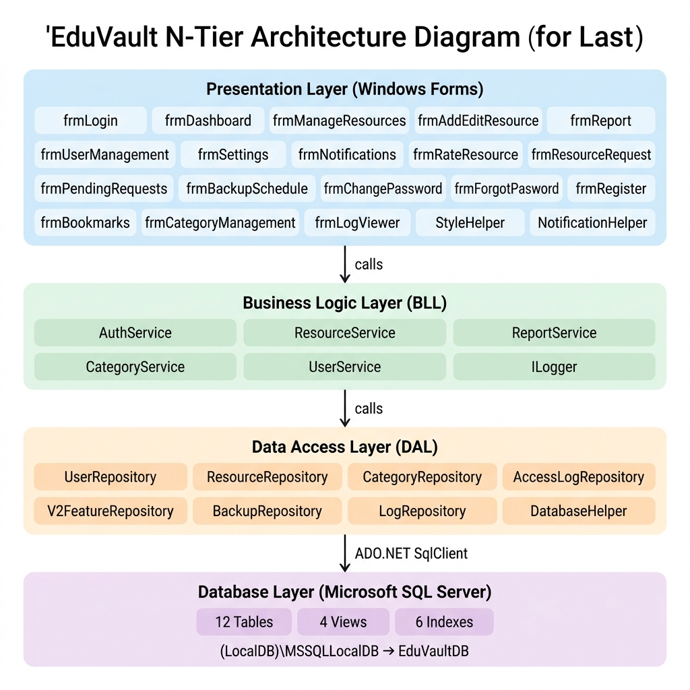
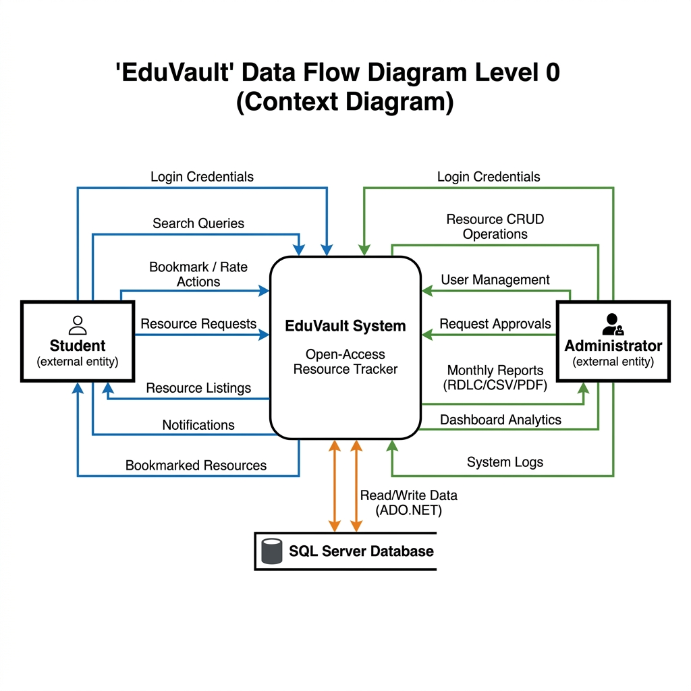
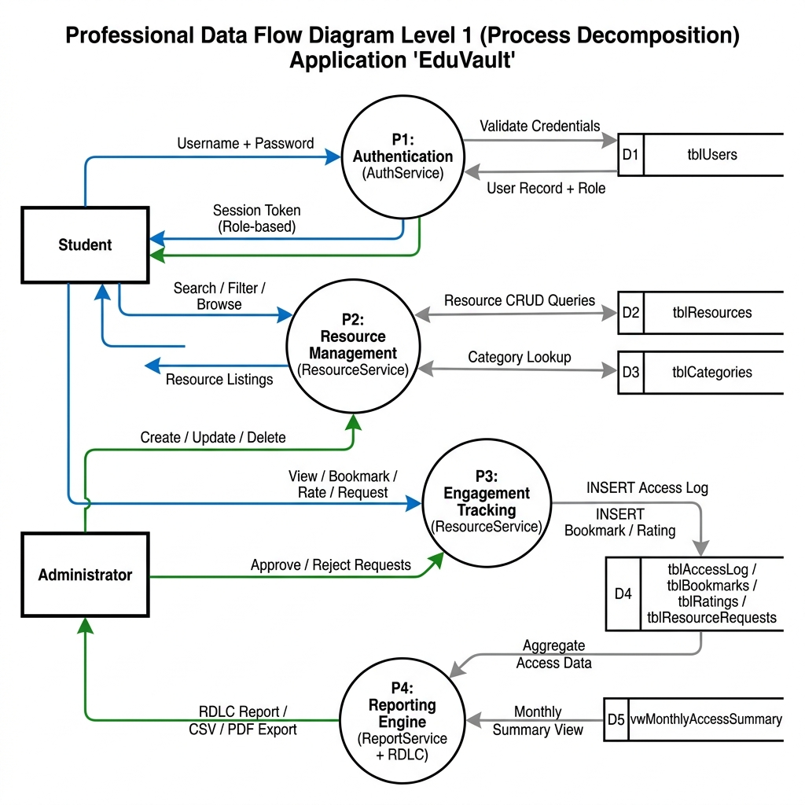

# EduVault — Software Design & Analysis Document (SDAD)

| | |
|---|---|
| **Project** | EduVault — Open-Access Resource Tracker for Students |
| **Course Code** | ITELEC1 — IT Elective 1 (.NET/C#) |
| **Program / Year** | BSIT, 2nd Year |
| **Semester** | 2nd Semester, Cycle 2, A.Y. 2025–2026 |
| **SDG Alignment** | UN SDG 4 — Quality Education |
| **Tech Stack** | VB.NET Windows Forms · Microsoft SQL Server · ADO.NET |

---

## 1. Introduction

### 1.1 Project Overview

EduVault is a desktop application built with VB.NET Windows Forms that enables students to discover, access, rate, and bookmark open educational resources (OERs). Administrators have dedicated tools for curating the resource library, managing user accounts, reviewing resource requests, generating analytical reports, and scheduling database backups.

The application follows a strict **N-Tier Architecture** (Presentation → Business Logic → Data Access → Database), ensuring separation of concerns and maintainability.

### 1.2 UN Sustainable Development Goal

EduVault is aligned with **UN SDG 4 — Quality Education**:

| Target | Description | How EduVault Addresses It |
|---|---|---|
| **4.4** | Increase the number of youth and adults with relevant technical and vocational skills | Provides a centralized hub for discovering curated educational materials across multiple subjects and skill levels |
| **4.b** | Expand scholarships and access to quality educational resources | Tracks and promotes open-access, free-to-use learning resources to eliminate financial barriers to education |

---

## 2. Requirements Analysis

### 2.1 Functional Requirements (FR)

| ID | Requirement | Description | Implementation |
|---|---|---|---|
| FR1 | Data Persistence (CRUD) | The system must perform full Create, Read, Update, Delete operations on a SQL Server database using parameterized queries to prevent SQL injection | `frmManageResources` + `frmAddEditResource` → `ResourceService` → `ResourceRepository` |
| FR2 | Business Logic | The system must execute specific logic (engagement scoring, popularity tagging, password strength validation) within dedicated Class modules | `ResourceService.GetEngagementTag()`, `Resource.TotalEngagement`, `AuthService.ValidatePasswordStrength()` |
| FR3 | Reporting | The system must generate a professional report summarizing monthly resource access trends | `frmReport` → `ReportService` → `vwMonthlyAccessSummary` (RDLC + CSV export) |
| FR4 | Security | Implementation of a Login System with role awareness (Admin vs. Student) including account lockout after 3 failed attempts | `frmLogin` → `AuthService.Login()` → `Session.CurrentUser` |
| FR5 | User Management | Admins can create, edit, activate/deactivate user accounts | `frmUserManagement` → `UserService` → `UserRepository` |
| FR6 | Category Management | Admins can create and manage resource categories | `frmCategoryManagement` → `CategoryService` → `CategoryRepository` |
| FR7 | Resource Rating | Students can submit 1–5 star ratings and text reviews for resources | `frmRateResource` → `V2FeatureRepository.SubmitRating()` |
| FR8 | Resource Requests | Students can request new resources; Admins can approve/reject | `frmResourceRequest` + `frmPendingRequests` → `V2FeatureRepository` |
| FR9 | Notifications | The system sends alerts to users about new resources and request status changes | `frmNotifications` → `V2FeatureRepository.GetNotifications()` |
| FR10 | Bookmarks | Students can bookmark resources for quick access | `frmBookmarks` → `ResourceService` → `ResourceRepository` |

### 2.2 Non-Functional Requirements (NFR)

| ID | Requirement | Description | Implementation |
|---|---|---|---|
| NFR1 | UI Consistency | UI must follow standard naming conventions (e.g., `btnSubmit`, `lblStatus`, `dgvResources`) and maintain a clean, accessible layout | All form controls follow `prefix + PascalCase` convention; unified color palette via `StyleHelper.vb` |
| NFR2 | Maintainability | Code must be documented with XML comments explaining complex logic | Every public class and method has `''' 
` XML doc comments |
| NFR3 | Reliability | Database connection strings must be managed via configuration files or a dedicated Connection Class | `App.config` → `DatabaseHelper.vb` reads `ConfigurationManager.ConnectionStrings("EduVaultDB")` |
| NFR4 | Performance | Indexed columns for common search/filter operations | Non-clustered indexes on `CategoryID`, `ResourceType`, `DateAdded`, `AccessDate`, `UserID` |
| NFR5 | Robustness | Comprehensive Try-Catch-Finally blocks and structured error messaging | All DAL/BLL methods wrapped in `Try-Catch`; user-facing errors shown via `MessageBox` |

---

## 3. Database Design

### 3.1 Entity Relationship Diagram (ERD)

The Entity Relationship Diagram below illustrates the relationships between the core tables in the EduVault database. The complete ERD image is available at `DOCUMENTATION/ERD_Diagram.png`.

**Core Relationships:**
- `tblUsers` **1 → M** `tblResources` (via `AddedBy` FK) — A user can upload many resources
- `tblCategories` **1 → M** `tblResources` (via `CategoryID` FK) — A category contains many resources
- `tblUsers` **1 → M** `tblAccessLog` (via `UserID` FK) — A user generates many access log entries
- `tblResources` **1 → M** `tblAccessLog` (via `ResourceID` FK) — A resource has many access events
- `tblUsers` **M → M** `tblResources` (via `tblBookmarks` junction table) — Many users can bookmark many resources
- `tblUsers` **M → M** `tblResources` (via `tblRatings` junction table) — Many users can rate many resources
- `tblUsers` **1 → M** `tblNotifications` (via `UserID` FK) — A user receives many notifications
- `tblUsers` **1 → M** `tblResourceRequests` (via `UserID` FK) — A user can submit many resource requests
- `tblResources` **1 → M** `tblResourceVersions` (via `ResourceID` FK) — A resource has a version history

### 3.2 Data Dictionary

Below is the complete data dictionary listing every table, field, data type, and constraint in the EduVault database.

---

#### tblUsers
Stores all registered users (Admins and Students) including authentication and preference data.

| Column | Data Type | Constraint | Description |
|---|---|---|---|
| UserID | INT | PK, IDENTITY(1,1) | Unique user identifier |
| Username | NVARCHAR(50) | NOT NULL, UNIQUE | Login username |
| PasswordHash | NVARCHAR(256) | NOT NULL | SHA-256 hashed password (never plain text) |
| FullName | NVARCHAR(100) | NOT NULL | User's display name |
| Email | NVARCHAR(100) | NULL | Optional contact email |
| Role | NVARCHAR(20) | NOT NULL, CHECK('Admin','Student') | User role for access control |
| IsActive | BIT | NOT NULL, DEFAULT 1 | 0 = deactivated account |
| DateCreated | DATETIME | NOT NULL, DEFAULT GETDATE() | Account creation timestamp |
| FailedLoginCount | INT | NOT NULL, DEFAULT 0 | Tracks consecutive failed login attempts |
| LockoutEndTime | DATETIME | NULL | If set, account is locked until this time |
| LastLoginDate | DATETIME | NULL | Timestamp of most recent successful login |
| PasswordResetToken | NVARCHAR(64) | NULL | SHA-256 hash of reset token for forgot-password flow |
| ResetTokenExpiry | DATETIME | NULL | Expiration time for the password reset token |
| EmailVerified | BIT | NOT NULL, DEFAULT 0 | Whether the user's email has been verified |
| FavouriteCategory | INT | NULL, FK → tblCategories | User's preferred category |
| DarkMode | BIT | NOT NULL, DEFAULT 0 | Per-user dark mode preference |

---

#### tblCategories
Stores resource categories for organizing educational materials (e.g., Mathematics, Science, IT).

| Column | Data Type | Constraint | Description |
|---|---|---|---|
| CategoryID | INT | PK, IDENTITY(1,1) | Unique category identifier |
| CategoryName | NVARCHAR(100) | NOT NULL, UNIQUE | Display name (e.g., "Mathematics") |
| Description | NVARCHAR(500) | NULL | Optional description of the category |
| IsActive | BIT | NOT NULL, DEFAULT 1 | 0 = archived category |
| DateCreated | DATETIME | NOT NULL, DEFAULT GETDATE() | Creation timestamp |

---

#### tblResources
Core table storing all open educational resources with metadata, engagement counters, and versioning.

| Column | Data Type | Constraint | Description |
|---|---|---|---|
| ResourceID | INT | PK, IDENTITY(1,1) | Unique resource identifier |
| Title | NVARCHAR(200) | NOT NULL | Resource display title |
| Description | NVARCHAR(1000) | NULL | Detailed description of the resource |
| CategoryID | INT | NOT NULL, FK → tblCategories | References the resource's category |
| SubjectArea | NVARCHAR(100) | NULL | Specific subject (e.g., "Calculus") |
| ResourceType | NVARCHAR(50) | NOT NULL, CHECK | 'E-Book', 'Video', 'Module', 'Reference', 'Article' |
| URL | NVARCHAR(500) | NULL | Web link to the resource |
| FilePath | NVARCHAR(500) | NULL | Local/network file path |
| EducationLevel | NVARCHAR(50) | NULL, CHECK | 'Beginner', 'Intermediate', 'Advanced' |
| Tags | NVARCHAR(500) | NULL | Comma-separated keywords for search |
| AddedBy | INT | NOT NULL, FK → tblUsers | User who uploaded the resource |
| DateAdded | DATETIME | NOT NULL, DEFAULT GETDATE() | Date the resource was added |
| IsActive | BIT | NOT NULL, DEFAULT 1 | 0 = soft-deleted |
| ViewCount | INT | NOT NULL, DEFAULT 0 | Total number of views (denormalized) |
| DownloadCount | INT | NOT NULL, DEFAULT 0 | Total number of downloads (denormalized) |
| ThumbnailPath | NVARCHAR(500) | NULL | Path to the resource's thumbnail image |
| CurrentVersion | INT | NOT NULL, DEFAULT 1 | Current version number |

---

#### tblAccessLog
Tracks every resource access event — the primary data source for monthly reporting and analytics.

| Column | Data Type | Constraint | Description |
|---|---|---|---|
| LogID | INT | PK, IDENTITY(1,1) | Unique log entry identifier |
| UserID | INT | NOT NULL, FK → tblUsers | The user who accessed the resource |
| ResourceID | INT | NOT NULL, FK → tblResources | The resource that was accessed |
| AccessDate | DATETIME | NOT NULL, DEFAULT GETDATE() | Timestamp of the access event |
| AccessType | NVARCHAR(20) | NOT NULL, CHECK | 'View', 'Bookmark', 'Download', 'Favourite', 'Review' |

---

#### tblBookmarks
Junction table enabling students to save resources for quick access. Composite unique constraint prevents duplicates.

| Column | Data Type | Constraint | Description |
|---|---|---|---|
| BookmarkID | INT | PK, IDENTITY(1,1) | Unique bookmark identifier |
| UserID | INT | NOT NULL, FK → tblUsers | The student who bookmarked |
| ResourceID | INT | NOT NULL, FK → tblResources | The bookmarked resource |
| DateBookmarked | DATETIME | NOT NULL, DEFAULT GETDATE() | When the bookmark was saved |
| — | — | UNIQUE(UserID, ResourceID) | Prevents duplicate bookmarks |

---

#### tblRatings
Stores 1–5 star ratings and optional text reviews. One rating per user per resource (upsertable).

| Column | Data Type | Constraint | Description |
|---|---|---|---|
| RatingID | INT | PK, IDENTITY(1,1) | Unique rating identifier |
| UserID | INT | NOT NULL, FK → tblUsers | The user who submitted the rating |
| ResourceID | INT | NOT NULL, FK → tblResources | The rated resource |
| Stars | TINYINT | NOT NULL, CHECK(1–5) | Star rating value |
| ReviewText | NVARCHAR(1000) | NULL | Optional text review |
| DateRated | DATETIME | NOT NULL, DEFAULT GETDATE() | When the rating was submitted |
| — | — | UNIQUE(UserID, ResourceID) | One rating per user per resource |

---

#### tblNotifications
Stores system alerts and broadcasts sent to individual users.

| Column | Data Type | Constraint | Description |
|---|---|---|---|
| NotificationID | INT | PK, IDENTITY(1,1) | Unique notification identifier |
| UserID | INT | NOT NULL, FK → tblUsers | The recipient user |
| Message | NVARCHAR(500) | NOT NULL | Notification text content |
| IsRead | BIT | NOT NULL, DEFAULT 0 | Whether the user has read it |
| DateCreated | DATETIME | NOT NULL, DEFAULT GETDATE() | When the notification was generated |
| RelatedResourceID | INT | NULL, FK → tblResources | Optionally links to a resource |

---

#### tblResourceRequests
Stores requests from students asking administrators to add specific materials to the library.

| Column | Data Type | Constraint | Description |
|---|---|---|---|
| RequestID | INT | PK, IDENTITY(1,1) | Unique request identifier |
| UserID | INT | NOT NULL, FK → tblUsers | The student who submitted the request |
| Title | NVARCHAR(200) | NOT NULL | Name of the requested resource |
| Description | NVARCHAR(1000) | NULL | Detailed description of what is needed |
| CategoryID | INT | NULL, FK → tblCategories | Suggested category for the resource |
| Status | NVARCHAR(20) | NOT NULL, CHECK, DEFAULT 'Pending' | 'Pending', 'Approved', 'Rejected', 'Fulfilled' |
| DateRequested | DATETIME | NOT NULL, DEFAULT GETDATE() | When the request was submitted |
| AdminNotes | NVARCHAR(500) | NULL | Admin's response or notes |

---

#### tblFavourites
Named curated lists; distinct from the quick-save bookmark feature.

| Column | Data Type | Constraint | Description |
|---|---|---|---|
| FavouriteID | INT | PK, IDENTITY(1,1) | Unique favourite identifier |
| UserID | INT | NOT NULL, FK → tblUsers | The user who favourited |
| ResourceID | INT | NOT NULL, FK → tblResources | The favourited resource |
| ListName | NVARCHAR(100) | NOT NULL, DEFAULT 'My Favourites' | Named list for organization |
| DateAdded | DATETIME | NOT NULL, DEFAULT GETDATE() | When the favourite was added |
| — | — | UNIQUE(UserID, ResourceID, ListName) | Prevents duplicates within a list |

---

#### tblResourceVersions
Audit trail that saves a snapshot before every resource edit, enabling version history tracking.

| Column | Data Type | Constraint | Description |
|---|---|---|---|
| VersionID | INT | PK, IDENTITY(1,1) | Unique version identifier |
| ResourceID | INT | NOT NULL, FK → tblResources | The resource being versioned |
| VersionNumber | INT | NOT NULL | Sequential version number |
| ChangeSummary | NVARCHAR(500) | NULL | Description of changes made |
| ChangedBy | INT | NOT NULL, FK → tblUsers | User who made the edit |
| ChangeDate | DATETIME | NOT NULL, DEFAULT GETDATE() | When the change occurred |
| SnapshotJSON | NVARCHAR(MAX) | NULL | JSON snapshot of the resource before edit |

---

#### tblBackupSchedule
Stores configuration for the automated database backup system.

| Column | Data Type | Constraint | Description |
|---|---|---|---|
| ScheduleID | INT | PK, IDENTITY(1,1) | Unique schedule identifier |
| FrequencyDays | INT | NOT NULL, DEFAULT 7 | How often backups should run (in days) |
| BackupPath | NVARCHAR(500) | NOT NULL | File system path for backup storage |
| LastBackupDate | DATETIME | NULL | When the last backup was performed |
| NextBackupDate | DATETIME | NULL | When the next backup is due |
| IsEnabled | BIT | NOT NULL, DEFAULT 1 | Whether automated backups are active |

---

#### tblLog
Application-level error and audit log for system diagnostics.

| Column | Data Type | Constraint | Description |
|---|---|---|---|
| LogID | INT | PK, IDENTITY(1,1) | Unique log entry identifier |
| LogLevel | NVARCHAR(10) | NOT NULL | Severity level (e.g., 'ERROR', 'INFO') |
| Message | NVARCHAR(500) | NOT NULL | Log message content |
| LogDate | DATETIME | NOT NULL, DEFAULT GETDATE() | Timestamp of the log entry |

---

### 3.3 Database Views

| View Name | Purpose |
|---|---|
| `vwResourceSummary` | Joins Resources with Category and User tables for display; includes all V2 columns |
| `vwMonthlyAccessSummary` | Aggregates access counts by resource and month — primary data source for RDLC reports |
| `vwResourceRatings` | Calculates average stars, total ratings, min/max per resource |
| `vwTopActiveUsers` | Top 10 most active users in the last 30 days |

---

## 4. System Architecture

### 4.1 N-Tier Architecture Diagram

The diagram below shows the complete N-Tier separation used in EduVault. Each layer only communicates with the layer directly below it. The full diagram is available at `DOCUMENTATION/NTier_Architecture.png`.

| Layer | Responsibility | Key Classes |
|---|---|---|
| **Presentation** | Windows Forms UI, user interaction, input validation | `frmLogin`, `frmDashboard`, `frmManageResources`, `frmReport`, + 14 more forms |
| **Business Logic** | Authentication, authorization, engagement scoring, reporting | `AuthService`, `ResourceService`, `ReportService`, `CategoryService`, `UserService` |
| **Data Access** | ADO.NET SqlClient, parameterized queries, data mapping | `UserRepository`, `ResourceRepository`, `CategoryRepository`, `AccessLogRepository`, `V2FeatureRepository`, `BackupRepository` |
| **Database** | SQL Server schema, views, indexes | 12 Tables, 4 Views, 6 Non-clustered Indexes |

### 4.2 Data Flow Diagram — Level 0 (Context Diagram)

The Context Diagram shows EduVault as a single process with its two external entities (Student and Administrator) and the database data store. The full diagram is available at `DOCUMENTATION/DFD_Level0_Context.png`.

| External Entity | Data Flows INTO System | Data Flows OUT of System |
|---|---|---|
| **Student** | Login credentials, search queries, bookmark/rate actions, resource requests | Resource listings, notifications, bookmarked resources |
| **Administrator** | Login credentials, resource CRUD operations, user management, request approvals | Monthly reports (RDLC/CSV/PDF), dashboard analytics, system logs |
| **SQL Server DB** | Query results, aggregated data | Parameterized INSERT/UPDATE/DELETE via ADO.NET |

### 4.3 Data Flow Diagram — Level 1 (Process Diagram)

The Level 1 DFD decomposes the system into four core processes. The full diagram is available at `DOCUMENTATION/DFD_Level1_Process.png`.

| Process | Description | Data Stores Used |
|---|---|---|
| **P1: Authentication** (AuthService) | Validates credentials, manages session, enforces lockout | D1: `tblUsers` |
| **P2: Resource Management** (ResourceService) | CRUD operations, search/filter, category lookup | D2: `tblResources`, D3: `tblCategories` |
| **P3: Engagement Tracking** (ResourceService) | Logs views/downloads, bookmarks, ratings, resource requests | D4: `tblAccessLog`, `tblBookmarks`, `tblRatings`, `tblResourceRequests` |
| **P4: Reporting Engine** (ReportService + RDLC) | Aggregates monthly data, generates RDLC/PDF/CSV reports | D5: `vwMonthlyAccessSummary`, `vwResourceRatings` |

---

## 5. Security Design

| Concern | Solution |
|---|---|
| Password Storage | SHA-256 one-way hash via `AuthService.GenerateHash()` — passwords are never stored in plain text |
| SQL Injection | Every query uses `cmd.Parameters.Add()` — no string concatenation in SQL statements |
| Role Enforcement | `Session.IsAdmin` is checked at form load and before every privileged operation |
| Soft-Delete | Records are never physically deleted; `IsActive = 0` preserves audit trail integrity |
| Account Lockout | Auto-lockout for 15 minutes after 3 consecutive failed login attempts |
| Password Reset | SHA-256 hashed token with server-side expiry — raw token never stored |
| Error Logging | Application errors logged to `tblLog` via `LogRepository` for post-mortem diagnostics |

---

## 6. Individual Contributions

> **Required by rubric:** *"A table detailing exactly which module/form was implemented by which member."*
> **⚠️ Fill in your group member names and Student IDs before submission.**

| Member Name | Student ID | Assigned Layer | Specific Files / Modules |
|---|---|---|---|
| [Member 1 — Full Name] | [ID] | **Database + Model Layer** | `01_Schema.sql`, `02_SeedData.sql`, `03_Migrations.sql`, `User.vb`, `Resource.vb`, `Category.vb`, `AccessLog.vb`, `Bookmark.vb`, `Session.vb` |
| [Member 2 — Full Name] | [ID] | **Data Access Layer (DAL)** | `DatabaseHelper.vb`, `UserRepository.vb`, `ResourceRepository.vb`, `CategoryRepository.vb`, `AccessLogRepository.vb`, `V2FeatureRepository.vb`, `BackupRepository.vb` |
| [Member 3 — Full Name] | [ID] | **Business Logic Layer (BLL)** | `AuthService.vb`, `ResourceService.vb`, `CategoryService.vb`, `UserService.vb`, `ReportService.vb`, `LogRepository.vb` |
| [Member 4 — Full Name] | [ID] | **Presentation Layer (Forms 1)** | `frmLogin.vb`, `frmDashboard.vb`, `frmManageResources.vb`, `frmSettings.vb`, `frmNotifications.vb`, `frmChangePassword.vb` |
| [Member 5 — Full Name] | [ID] | **Presentation Layer (Forms 2) + Reporting** | `frmAddEditResource.vb`, `frmReport.vb`, `frmUserManagement.vb`, `frmResourceRequest.vb`, `frmPendingRequests.vb`, `frmBackupSchedule.vb`, `frmRateResource.vb` |

> *For groups of fewer than 5 members, merge the layer assignments accordingly and redistribute modules.*

---

## 7. AI Assistance Disclosure

> **Academic Integrity — Required Citation (ITELEC1 Final Project Guidelines, 2026)**
>
> Portions of the source code scaffolding and initial documentation structure were generated with the assistance of **Antigravity AI (powered by Google DeepMind)** as an AI pair-programming tool. The AI assistance was used to produce:
> - N-Tier architecture boilerplate (DAL, BLL, and Model layers)
> - Parameterized ADO.NET query templates
> - V2 Advanced Feature Repositories and engagement logic
> - Windows Forms Designer file structure
> - Initial SDAD documentation outline
>
> All AI-generated output was **reviewed, understood, tested, and customized** by the group. Each member is individually accountable for their assigned layer and can explain, defend, and modify any part of the codebase during the Individual Practical Exam.
>
> This disclosure is provided in compliance with the academic integrity policy stated in the ITELEC1 Final Project Guidelines.
